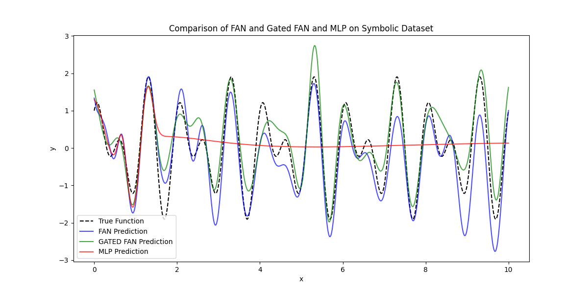

# Fourier Analysis Network Implementation

This repository contains an implementation of a Fourier Analysis Network (FAN), a novel neural network architecture designed to efficiently model and reason about periodic phenomena by leveraging Fourier Analysis.

## Repository Structure

- `model/`: Contains the implementation of the FAN, Gated FAN and MLP (baseline) models.
- `dataset.py`: Script for loading and preprocessing the synthetic dataset used for training and evaluation.
- `train.py`: Script to train the model.
- `evaluate.py`: Script to evaluate the trained model's performance and display the results.
- `run.py`: Main script to execute training and evaluation.
- `evaluation_plot.png`: Visualization of the model's evaluation results.

## Evaluation Results

This plot is a visualisation of how well a FAN, Gated FAN and MLP fits to the symbolic dataset. (Generated during evaluation)



We see that FAN and Gated FAN converges faster and reaches a smaller MSE loss compared to the MLP.

## Getting Started

### Prerequisites

Ensure you have the following installed:
- Python 3.9+
- Required Python packages (listed in `requirements.txt`)

### Installation

1. **Clone the repository:**
```bash
git clone https://github.com/Reuben-Stephen-John/Testing-Fourier-Analysis-Network-s-.git
cd Testing-Fourier-Analysis-Network-s-
```

2. **Install dependencies:**
```bash
pip install -r requirements.txt
```

## Usage

1. **Run the complete pipeline:**
```bash
python run.py
```
   - This script will execute both training and evaluation sequentially.

## License

This project is licensed under the MIT License - see the LICENSE file for details.

## Significance

Fourier Analysis Networks (FAN) integrate Fourier Analysis into neural network architectures, enhancing their ability to model periodic patterns inherent in various data types. By explicitly encoding periodicity, FANs improve generalization and performance, particularly in tasks involving periodic phenomena.


## References

- [FAN: Fourier Analysis Networks](https://arxiv.org/abs/2410.02675). ArXiv.

For more details on Fourier Analysis and its applications, consider the following resources:
- [Github Code for FAN](https://github.com/YihongDong/FAN)
- [A Comprehensive Guide on Fourier Analysis](https://betterexplained.com/articles/an-interactive-guide-to-the-fourier-transform/)
- [An Interactive Guide To The Fourier Transform](https://www.jezzamon.com/fourier/)
- [Inspired Medium Article](https://levelup.gitconnected.com/fourier-analysis-networks-fans-are-here-to-break-barriers-in-ai-1c521c6656bc)

Feel free to explore these resources to deepen your understanding of Fourier Analysis and its significance in neural network architectures.